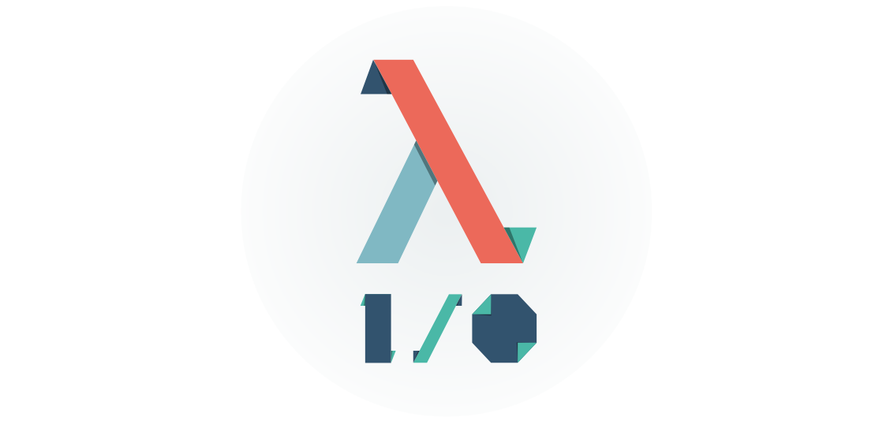

# El manifiesto Lambda I/O

> No, eso no és sobre la utilización de programación funcional con tratamientos
con monads para efectos secundarios. Eso és, actualmente, una iniciativa
abierta para **propagar programación funcional por todo el mundo**.

## Tabla de contenidos

- [¿Quiénes somos?](#who-are-we)
- [Motivación](#motivation)
- [¿Como?](#how)
- [Nuestros principios](#our-principles)
- [Enlaces Útiles](#useful-links)
- [Traducciones](#translations)
- [Contribuición](#contributing)
- [Licencia](#license)

## ¿Quiénes somos?

La Fundación Lambda/IO és una iniciativa abierta que pretende introducir a la
gente de todo el mundo las ventajas y características del paradigma funcional.

Nuestro objectivo es lograr eso con la organización de pequeños, aunque
amigables meetups centrándose en programación funcional en todo el mundo, que
culminaría en un gran evento por cada país.

Nuestra misión es deconstruir el adoctrinamiento que rodea lenguajes impertivos,
enseñando lo que, desafortunadamente, asola muchos lugares en el mundo y,
consecutivamente, los sistemas de TI - que van desde cursos técnicos hasta
cursos de postgrado, proporcionando recursos y una comunidad que hace con que
sea fácil aprender acerca de lenguajes funcionales, el paradigma funcional y
casos de uso.

## Motivación

La iniciativa nació en Brasil, creado por un pequeño grupo de estudiantes técnicos
y graduados que solamente estaban cansados de aprender siempre los mismos
conceptos imperativos y lenguajes de sus clases.

Como el [functional buzz](https://medium.com/@jugoncalves/functional-programming-should-be-your-1-priority-for-2015-47dd4641d6b9)
crece, es muy común ver en estos días la gente cuestinando sobre lo que es, en verdad,
programación funcional y sus conceptos, pero con dificuldad para encontrar los recursos ideales,
buena motivación, o hasta mismo una comunidad para apoyar sus estudios y la aprendizaje.
La situación solo empeora quando nos damos cuenta de que muchos de los profesionales
de TI, personas que trabajan con desarollo de software - y hasta mismo estudiantes
de Ciencias de la Computación - ni siquiera se enteraron de un paradigma como el
funcional.

## How?

### Meetups

The idea is to make small Lambda I/O Meetups per city. Those meetups consists of
an one-day meetup with talks - and maybe workshops - about everything in the
functional world:

- The paradigm itself
- *Purist* languages
- Functional libs and implementations
- Parallelism/Concurrency
- Benefits
- Use cases
- ...

Those *Lambda I/O Meetups* have a pre-formatted style which can be found [here](https://github.com/lambda-io/meetup-organization-guidelines).

### Conferences

The small meetups aim to promote the functional knowledge in distributed/
*(de)centralized* way but they aren't enough since they exactly **small meetups**.
So it is also important to promote big conferences yearly which would congregate
big amounts of people per country.

Those *Lambda I/O Conferences* have a pre-formatted style which can be found [here](https://github.com/lambda-io/conference-organization-guidelines).

## Our principles

### People matter

As stated in the [Motivation](#motivation) section, people are our reason. So it is very important to think about their experience - by helping them and being as nice as possible. Functional paradigm can be awesome - so why can't try to make people learning it feel awesome too?

### (De)centralization

Our philosophy works based on a centralized model of decentralization.
To help understanding, it can be divided in two points:

#### Decentralization

- **Anyone** has the freedom to organize Lambda I/O events **wherever** and
**whenever** he/she wants.

- The meetups are **independent of each other**.

- The Lambda I/O Foundation does not set specific details of the individual
scope of each meetup - such as *dates, agenda, sponsors, supporters* etc.

#### Centralization

- To make the organization and interaction of meetups with the proposal of the
foundation easier, all organizational repositories of meetups and conferences
are gathered in the [Lambda I/O Foundation](https://github.com/lambda-io)'s
Github organization. For each meetup it is created a team that will have full
power to define the details described in the [Decentralization](#decentralization) principle and
the teams only have access to their meetups - ensuring their independence. The
born of a meetup - and their respective team in the [Lambda I/O Foundation](https://github.com/lambda-io)'s
Github organization - only needs the interest of a possible facilitator as
stated [here](https://github.com/lambda-io/meetup-organization-guidelines).

- All the events - meetups and conferences - **must adhere to the basic
principles of the foundation** - as its proposal, code of conduct etc.

## Enlaces Útiles

> Deseamos tener muchos repositorios para ayudar a la gente con el proposito del *Lambda I/O*, como:

- [Guía del Organizador del Meetup](https://github.com/lambda-io/meetup-organization-guidelines)

  Un guía sencillo de como organizar los meetups Lambda I/O.

- [Guía del Organizador de Conferencia](https://github.com/lambda-io/conference-organization-guidelines)

  Un guía sencillo de como organizar las conferencias Lambda I/O.

- [Recursos](https://github.com/lambda-io/resources)

  Repositorio que contiene algunos recursos con lo objectivo de ayudar los organizadores de los
  eventos Lambda I/O por todo el mundo.

- [Código de Conducta](https://github.com/lambda-io/code-of-conduct)

  Todo evento necesita tenerlo.

- [Generador de Logo de Meetup](https://github.com/lambda-io/meetup-logo-generator)

  Generador de Logo para los meetups de cada ciudad.

- [Site del Meetup/Conferencia](https://github.com/lambda-io/site-boilerplate)

  Una manera mucho fácil de crear sitios web para conferencias/meetups.

## Traducciones

>- Deseamos que eso manifiesto seya traducido hasta el máximo de idiomas possibbles.
En el momento, eso son los que están disponibles. Si sentir la falta de cualquier
idioma y quierer ayudar a nosostros, no dude en [contribuir](#contributing).

- [Inglés](../README.md)
- [Portugués](../pt/README.md)

## Contribuición

Contribuiciones son bienvenidas! Si deseas ayudar en nuestra misión, los guías
de contribuición encuentran-se [aquí](../CONTRIBUTING.md).

## Licencia

Eso documento sobre él **Manifiesto Lambda I/O** y todo que aquí encuentra-se
está licenciado bajo una licencia [Creative Commons Attribution-NonCommercial 4.0 International](http://creativecommons.org/licenses/by-nc/4.0/)
excepto el logo y otras imágenes, que están licenciadas bajo una licencia [Creative Commons  Attribution-NonCommercial-NoDerivatives 4.0 International](http://creativecommons.org/licenses/by-nc-nd/4.0/) license.

*Se supone que todas las contribuiciones están bajo la misma licencia.*
